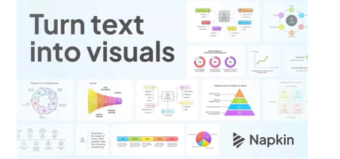

# Session 1: Introduction to Generative AI for Testers

## History of AI

## GenAI - Beyond Traditional AI

## LLM's

## Key Opportunities for Testers

* **Future - Using AI to automate the automation**

100x efficiency

Catch - You need to know what needs to be done

### Tool of the day - Napkin AI

We as a tester need to convey a lot of information as tester.  
It can trun turn text into visuals

* Basically it will help you to create smart visuls for your topic. you can also modify the details generated according to your requirement.

* It's free as now.

## https://www.futuretools.io

1. Visit future tools website
2. Filter tools
3. Select tools
4. Document tool
5. Share Findings in the shift sync platform

* Tag us, submit your question on shift sync platform