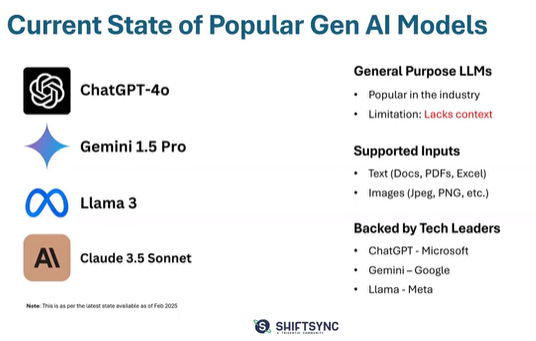
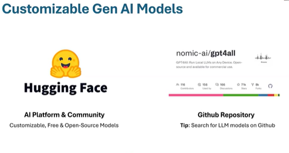
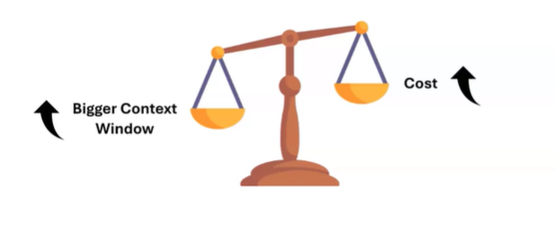
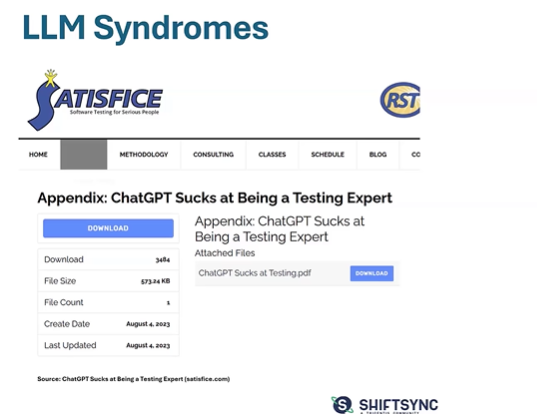
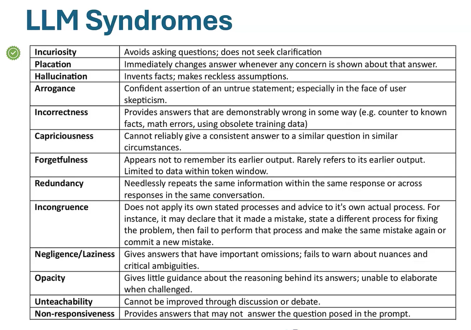
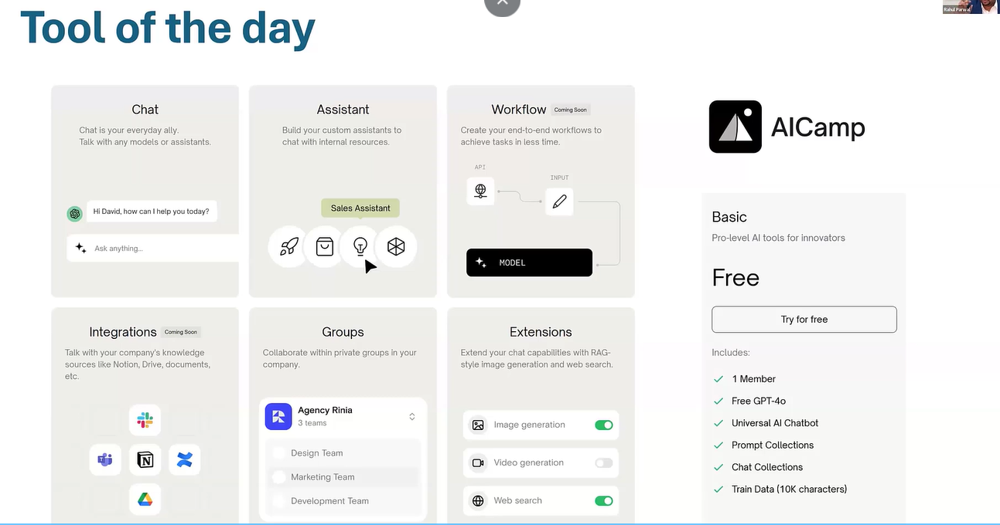
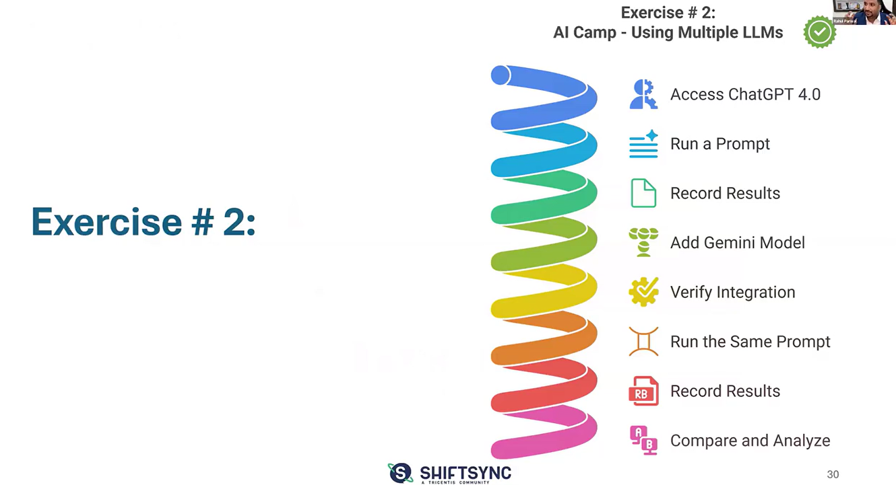

# Session 2: Deep Dive

## Current State of Popular Gen AI Models

Blackbox AI - Interesting
Mystral - Image topics

## Customizable Gen AI Models

## Model Selection Criteria

* Top performing models take more tokens and eventually cost arise of operating them(fast response,amazing response)
    * You need to find the sweet balance
* Bigger ontext window

* Dataset - is the model trained on the right data for the task?
* Support - Community support, troubleshooting docs, etc.
* Finetuning Possibility - Prompt Engineering

## Emerging Possibilites - LLMs
1. Task Specific LLMs
    * Code Generation
    * Content Writing
    * Image Generation
    * Customer Support
    * Test Design
2. Domain Specific LLMs
    * Medical Science
    * Scientific Research
    * Legal Domain
    * Financial Domain
    * Your Testing Domain(IOT, Aerospace, Healthcare, Medical)

## LLM Limitations
1. Biases in AI
    * AI will be biased on the data it is trained on.
2. Data Security & Rights
3. Algorithmic Obscurity
4. Garbage In, Garbage Out.

## LLM Syndromes

## Popular Use Cases for Testers

## Tool of the Day

## Demo of the tool

## Exercise #2

