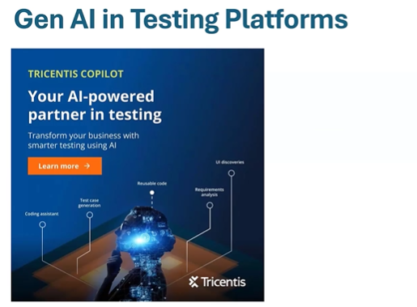
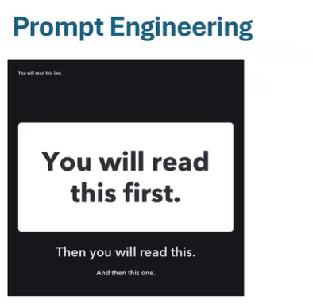
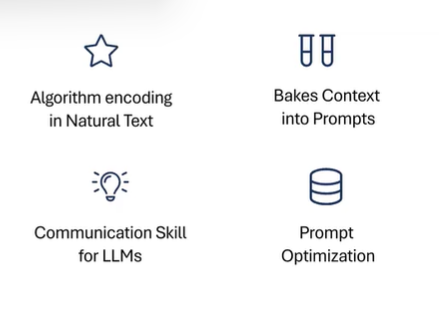
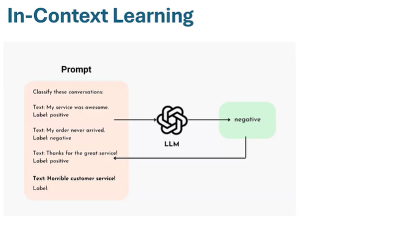
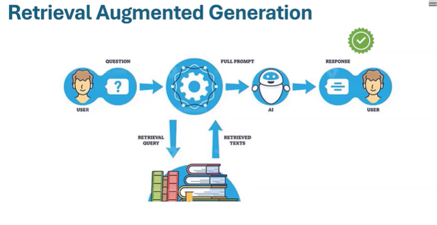
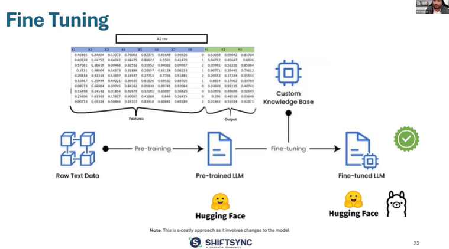
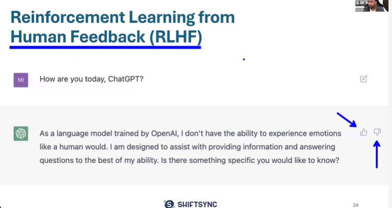
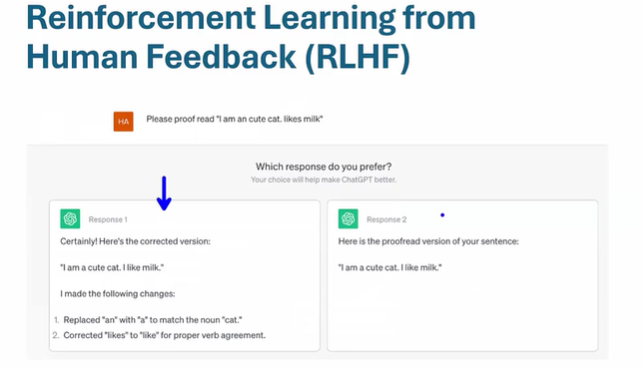
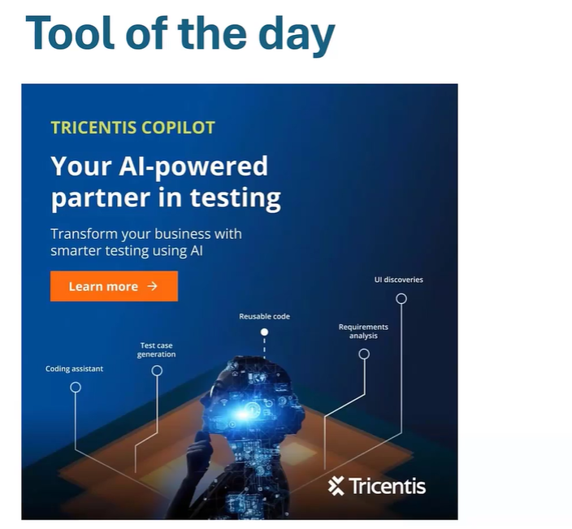
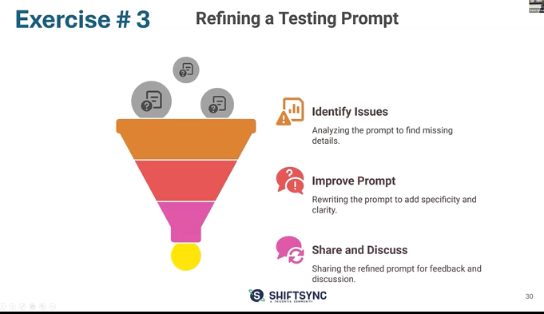

# Generative AI for Testers: Session 3

# Adopting LLMs for Testing Use Cases

## Gen AI in Testing Platforms

* Lot of learning materials available in ShiftSync Platform - Webinar, Blog, articles

## Advantages - Gen AI in Testing
1. Enhances Productivity
2. Reduces Manual & Redundant Effort
3. Analyze & Process Large Data
4. Humanized Outputs

# Prompt Engineering

* Prompt engineering is also essentially writing your text in a manner that you get the response from LLM how you want it to be. I mean you can get specific desired responses.
* It's a algorithm that you're encoding in the natural text. So it's not less than an algorithm, it's absolutely an algorithm for things you like kind of output.

## Prompt Engineering - Hacks
1. Be Specific
For example, instead of saying - Give short replies. reply in 2 lines
2. Avoid "Not To Do". Instead of saying what "not to do" mention "what to do"
3. Give Context
    * Context is King
4. Define a Persona
    * Ask it to act like a "tester" or "automation engineer" or "requirement reviewer"
5. Vary Modes
    * Creative, Balanced, Precise
6. Share Examples
    * Out format, sample code, etc

## In-Context Learning

## Retrieval Augmented Generation

* Now RAG capabilites are available in LLMs there itself.

* Retrieval from - 
    * Text(Docs, PDFs, Excel, Code, DB)
    * Images(JPEG, PNG, etc.)
    * Website
* Saves
    * Retraining time
    * Retraining costs

## Fine Tuning
* So if you ahve a model but you want to train them on your custom knowledge base.
* So it's basically a base model + a more context specific model

## Reinforcement Learning from Human Feedback(RLHF)
* Because at the end of day human is the most critical aspect.

## Tool of the day

## Refining a Testing Prompt

Exercise #3 -  

