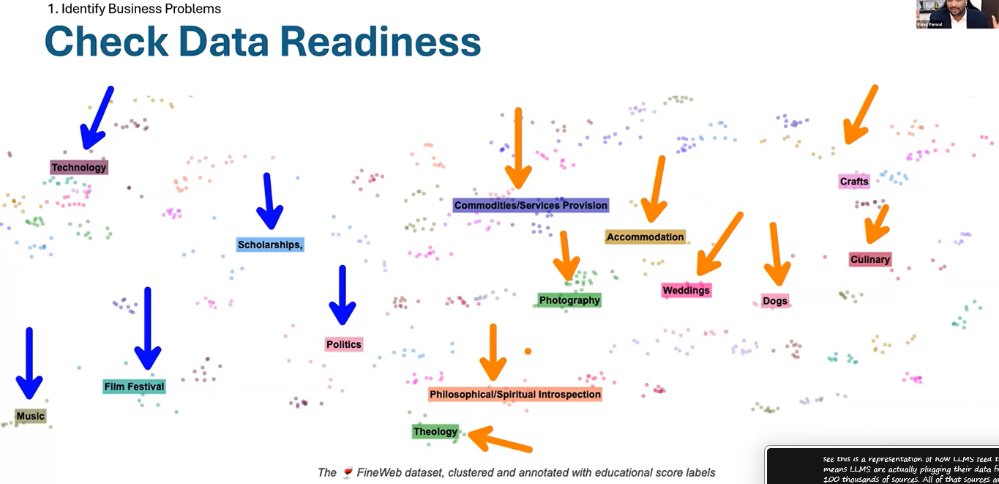
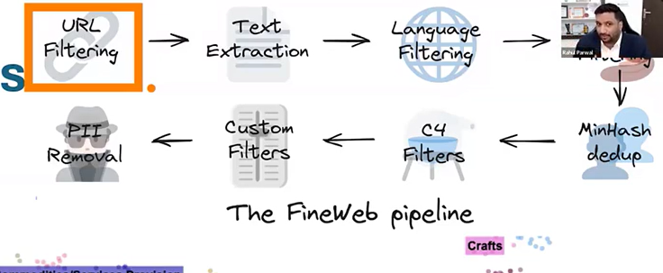
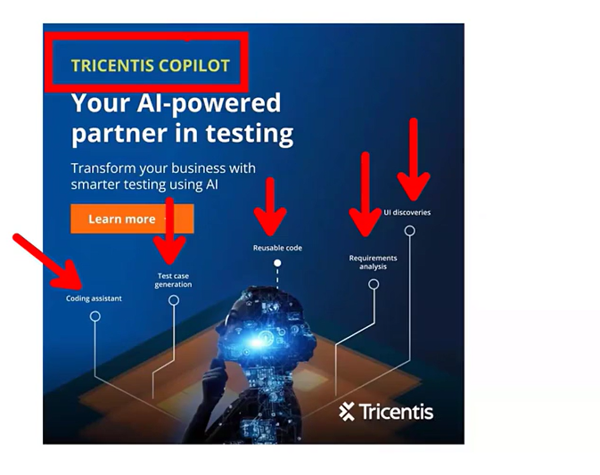
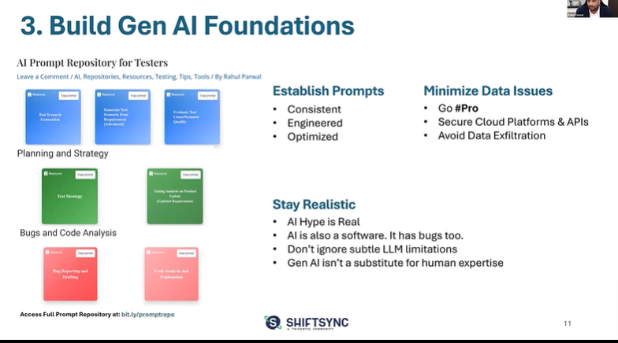
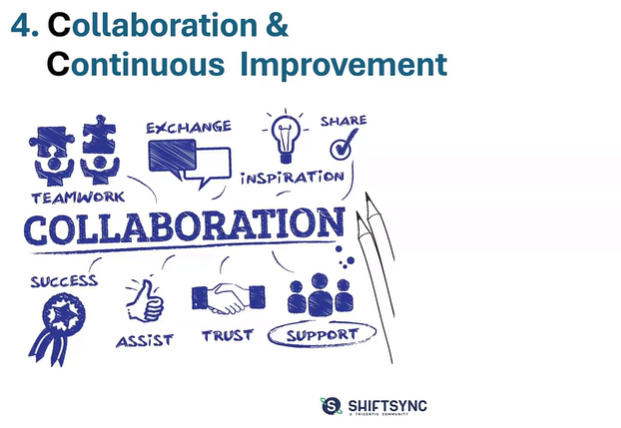
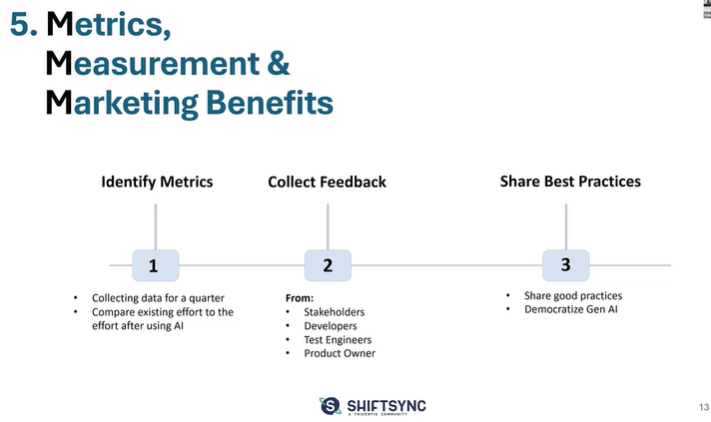
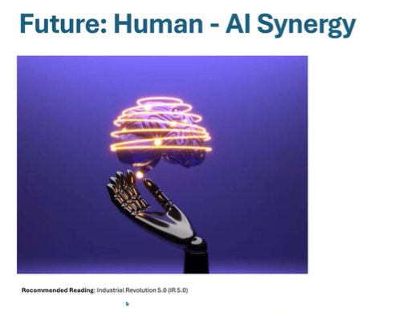
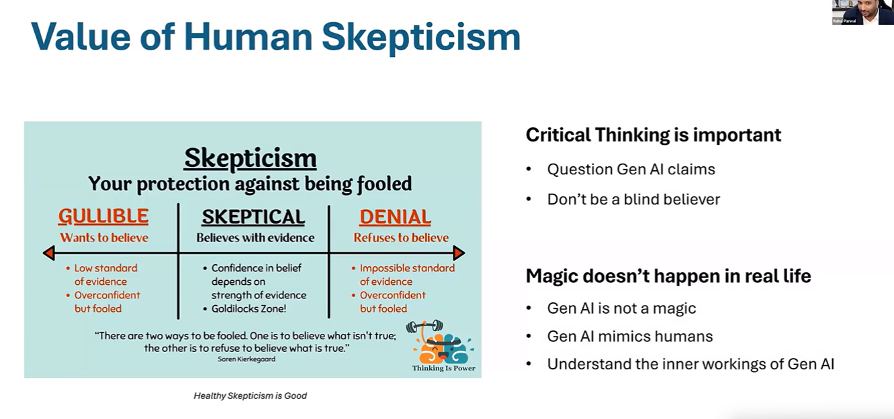
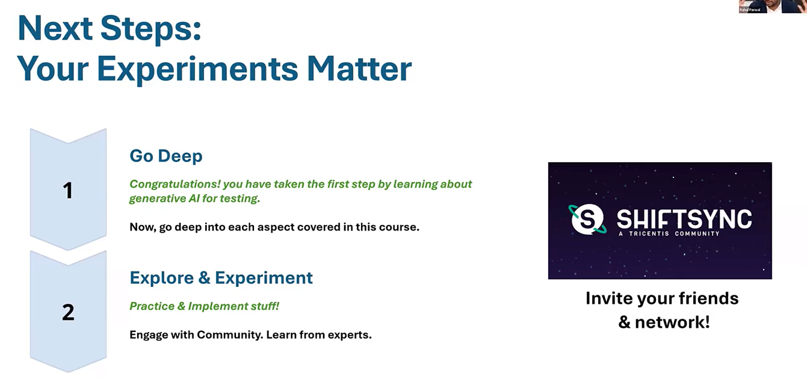

# Generative AI for Testers: Session 4

## Implementing Gen AI

## Strategizing - Gen AI as a tester
1. Identify problems
2. Select Platform
3. Build Foundations
4. Collaborate & Improve
5. Measure & Market

## Identify Business Problems

Waht is something that you are getting measured on? what is your KRA? What are you supposed to do? Somebody has to write script, somebody has to create architecture, somebody has to probably do test management or test leading. But what is your high value task? That's the first step.  

And then consider the business impact. I mean consider that if you can improve on these tasks or if you build in some efficiency in these tasks, what will be the impact on the business. I mean we are all there. To solve business problems, I mean what is the business impact of our technical solution? This is the most important thing and foremost thing before trying out any tool.  

Try to map that and then identify the complexity and risks. Now I've specifically mentioned the word risks because a lot of time we can do something with a too but is it going to bring some risk? is it going to risk may be related to some confidentiality.Are there some risks probably if you feed your requirements. are there some risk probably if you generate your test data?What is the complexity involved? what are the risks involved? Identify all of that.  

1. Identify High Value AI Tasks
2. Consider Business Impact
3. Identify Complexity & Risks
4. Check Data Readiness

### 1. Check Data Readiness

**Data is the Oil of Gen AI Systems**  
* Do you have data is fine tune model?
* Is the data well labelled or segregated?

**General Data = General Results**  
* Lacks Context
* Suffers from own internal biases & syndromes

### 2. Select Data Platform

* Cursor AI and Github Copilot for Coding.

**Ensures -**  
* Security
* Governance
* Scalabiltiy

**Safety From -** 
* Licensing Issues
* Data Privacy Issues
* IP Issues
* Data Infringement Issues

### 3. Build Gen AI Foundations

### 4. Collaboration & Continuous Improvement

* https://snackprompt.com
* Invite your friends & Network

### 5. Metrics, Measurement & Marketing Benefits

# Future: Human - AI Synergy

* AI is Amplifier; Not Replacement
* It is Copilot; Not Pilot
* It is Assistant; Not Master
* It Mimics Intelligence; Not Intelligent

## Gen AI - A double edge sword
* Generate Test Ideas, Data, Code but lacks Context & Situational Awareness
* Gen AI can create fresh data, algorithms, Articles but if you are using public LLM's you are susceptible to IP, data privacy & Governance Issues
* It mimics Human intelligence & response patterns but hallucinates in responses(basically decide for yourself)

## Next Steps
* Engage on Shiftsync platforms
* learns from quiz, articles, peers, webinars, forums

**but your experiments matter**  

## Tool of the day

AI in Testing - Compiled resources  

* https://testingtitbits.com/ai-in-testing-compiled-resources/

## Exercise #4

